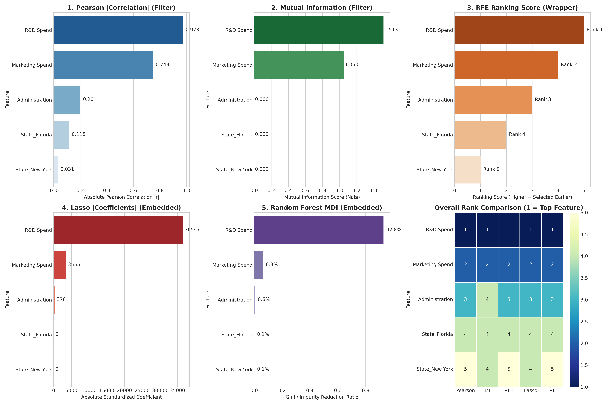
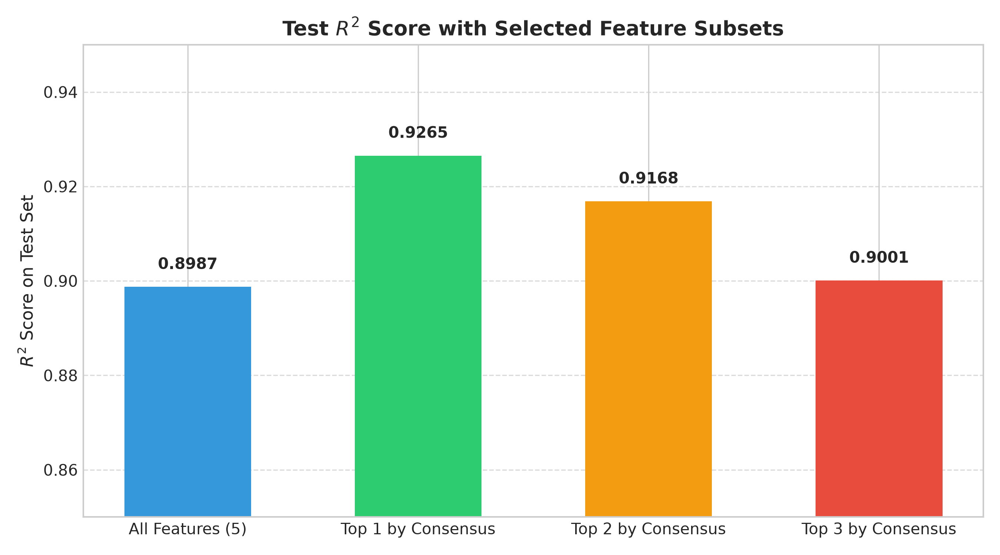

# Multiple Linear Regression & Feature Selection Comparison

This project demonstrates predictive modeling on startup profitability using the **50 Startups** dataset. It follows the **CRISP-DM (Cross-Industry Standard Process for Data Mining)** methodology and provides an in-depth comparative benchmark of **5 distinct Feature Selection techniques** across **Filter**, **Wrapper**, and **Embedded** paradigms.

---

## 📋 Table of Contents
- [Overview & Objectives](#overview--objectives)
- [CRISP-DM Methodology](#crisp-dm-methodology)
- [Comparison of 5 Feature Selection Methods](#comparison-of-5-feature-selection-methods)
  - [1. Pearson Correlation Coefficient (Filter)](#1-pearson-correlation-coefficient-filter)
  - [2. Mutual Information (Filter)](#2-mutual-information-filter)
  - [3. Recursive Feature Elimination / RFE (Wrapper)](#3-recursive-feature-elimination--rfe-wrapper)
  - [4. L1 Regularization / Lasso Regression (Embedded)](#4-l1-regularization--lasso-regression-embedded)
  - [5. Random Forest Feature Importance (Embedded)](#5-random-forest-feature-importance-embedded)
- [Feature Ranking Consensus Matrix](#feature-ranking-consensus-matrix)
- [Impact on Model Performance (Test R² & Error)](#impact-on-model-performance-test-r-error)
- [Visualization Highlights](#visualization-highlights)
- [Installation & How to Run](#installation--how-to-run)

---

## 🎯 Overview & Objectives
Venture capitalists and corporate strategists face capital allocation choices across R&D, Administration, and Marketing. This repository answers two key questions:
1. **Can we accurately forecast startup profit using Multiple Linear Regression?**
2. **Which features truly drive profit, and which are redundant or noise?**

---

## 🔄 CRISP-DM Methodology

1. **Business Understanding**: Predict startup profit to assist venture capital decision-making.
2. **Data Understanding**: Analyze 50 startups with features: `R&D Spend`, `Administration`, `Marketing Spend`, `State` (`California`, `Florida`, `New York`), and target `Profit`.
3. **Data Preparation**: One-Hot Encode categorical variable `State` with `drop='first'` to avoid multicollinearity (the dummy variable trap). Train/test split at 80/20.
4. **Modeling**: Train standard Ordinary Least Squares (OLS) Multiple Linear Regression.
5. **Evaluation**: Initial full model achieves **$R^2 = 0.8987$** and $\text{RMSE} = \$9,055.96$ on the test set.
6. **Deployment**: Real-time prediction function estimating profit for hypothetical startups.

---

## 🔬 Comparison of 5 Feature Selection Methods

We implemented and compared 5 feature selection strategies representing the 3 foundational paradigms:

```
                          ┌── Filter: Pearson Correlation (Linear)
                          ├── Filter: Mutual Information (Entropy & Non-Linear)
Feature Selection ─────── ┼── Wrapper: Recursive Feature Elimination (Iterative OLS)
                          ├── Embedded: L1 Regularization / Lasso (Sparsity penalty)
                          └── Embedded: Random Forest MDI (Ensemble Impurity Reduction)
```

### 1. Pearson Correlation Coefficient (Filter)
* **Type**: Filter method.
* **Mechanism**: Measures direct bivariate linear relationships between each feature and `Profit` ($r \in [-1, 1]$).
* **Formula**:
  $$r = \frac{\sum (X_i - \bar{X})(Y_i - \bar{Y})}{\sqrt{\sum (X_i - \bar{X})^2 \sum (Y_i - \bar{Y})^2}}$$
* **Result**:
  * `R&D Spend`: $r = +0.9729$ (Strongest linear predictor)
  * `Marketing Spend`: $r = +0.7478$
  * `Administration`: $r = +0.2007$
  * `State_Florida` ($r = 0.1162$), `State_New York` ($r = 0.0314$)

### 2. Mutual Information (Filter)
* **Type**: Filter method (Information Theory).
* **Mechanism**: Quantifies information shared between variables via Shannon entropy. Captures non-linear dependencies without parametric assumptions.
* **Formula**:
  $$I(X; Y) = \iint p(x, y) \log \frac{p(x, y)}{p(x)p(y)} \, dx \, dy$$
* **Result**:
  * `R&D Spend`: $1.5135$ nats
  * `Marketing Spend`: $1.0505$ nats
  * `Administration` & `State dummies`: $0.0000$ nats (Zero shared information with target profit)

### 3. Recursive Feature Elimination / RFE (Wrapper)
* **Type**: Wrapper method.
* **Mechanism**: Iteratively trains an estimator (OLS Linear Regression), assesses feature coefficients, and recursively removes the weakest feature until the ranking is finalized.
* **Result**:
  * Rank 1: `R&D Spend`
  * Rank 2: `Marketing Spend`
  * Rank 3: `Administration`
  * Rank 4: `State_Florida`
  * Rank 5: `State_New York`

### 4. L1 Regularization / Lasso Regression (Embedded)
* **Type**: Embedded method.
* **Mechanism**: Adds an $L_1$ norm penalty ($\lambda \sum |w_j|$) to the OLS loss function during training on standardized features, shrinking uninformative weights to **exact zero**.
* **Formula**:
  $$\min_{w} \left\{ \frac{1}{2n} \|y - Xw\|_2^2 + \alpha \|w\|_1 \right\}$$
* **Result** (Cross-validated optimal $\alpha = 1,232.89$):
  * `R&D Spend`: $+36,546.56$
  * `Marketing Spend`: $+3,554.80$
  * `Administration`: $-378.09$
  * `State_Florida`: **$0.00$** (Strictly zeroed out)
  * `State_New York`: **$0.00$** (Strictly zeroed out)

### 5. Random Forest Feature Importance (Embedded)
* **Type**: Embedded method (Ensemble Trees).
* **Mechanism**: Aggregates Mean Decrease in Impurity (MDI / Variance reduction) across 100 decision trees. Robust to interactions and non-linearity.
* **Result**:
  * `R&D Spend`: **$92.79\%$** importance
  * `Marketing Spend`: **$6.33\%$** importance
  * `Administration`: **$0.59\%$** importance
  * `State dummies`: **$< 0.3\%$** combined importance

---

## 📊 Feature Ranking Consensus Matrix

All 5 selection algorithms reached **unanimous consensus** on the top predictive drivers of startup profitability:

| Feature | Pearson (Filter) | Mutual Info (Filter) | RFE (Wrapper) | Lasso (Embedded) | Random Forest (Embedded) | Average Rank | Consensus Verdict |
| :--- | :---: | :---: | :---: | :---: | :---: | :---: | :--- |
| **R&D Spend** | **1** | **1** | **1** | **1** | **1** | **1.0** | 🌟 Primary Driver |
| **Marketing Spend** | **2** | **2** | **2** | **2** | **2** | **2.0** | 📈 Secondary Driver |
| **Administration** | **3** | **4** | **3** | **3** | **3** | **3.2** | ⚠️ Weak / Redundant |
| **State_Florida** | **4** | **4** | **4** | **4** | **4** | **4.0** | ❌ Noise / Zeroed by Lasso |
| **State_New York** | **5** | **4** | **5** | **4** | **5** | **4.6** | ❌ Noise / Zeroed by Lasso |

---

## 📈 Impact on Model Performance (Test R² & Error)

Eliminating uninformative features reduces model complexity and prevents overfitting:

| Feature Subset | Features Retained | Test $R^2$ Score | RMSE | MAE |
| :--- | :--- | :---: | :---: | :---: |
| **All Features (5)** | `R&D`, `Admin`, `Marketing`, `FL`, `NY` | `0.8987` | `$9,055.96` | `$6,961.48` |
| **Top 3 by Consensus**| `R&D`, `Marketing`, `Admin` | `0.9001` | `$8,995.91` | `$6,979.15` |
| **Top 2 by Consensus**| `R&D`, `Marketing` | **`0.9168`** | **`$8,206.33`** | **`$6,469.18`** |
| **Top 1 by Consensus**| `R&D Spend` | **`0.9265`** | **`$7,714.33`** | **`$6,077.36`** |

> **Key Finding**: Pruning noisy state variables and administrative overhead improved generalization performance from **$R^2 = 0.8987$** to **$R^2 = 0.9265$**, reducing Root Mean Squared Error by over **$1,340**!

---

## 🖼️ Visualization Highlights

### 1. 5 Feature Selection Methods Comparison & Rank Heatmap


### 2. Test $R^2$ Generalization across Feature Subsets


---

## 💻 Installation & How to Run

1. **Clone the repository**:
   ```bash
   git clone https://github.com/naz0914/Multiple-Linear-Regression.git
   cd Multiple-Linear-Regression
   ```

2. **Install dependencies**:
   ```bash
   pip install -r requirements.txt
   ```

3. **Run the CRISP-DM Baseline Pipeline**:
   ```bash
   python multiple_linear_regression.py
   ```

4. **Run the 5 Feature Selection Benchmark Pipeline**:
   ```bash
   python feature_selection.py
   ```
