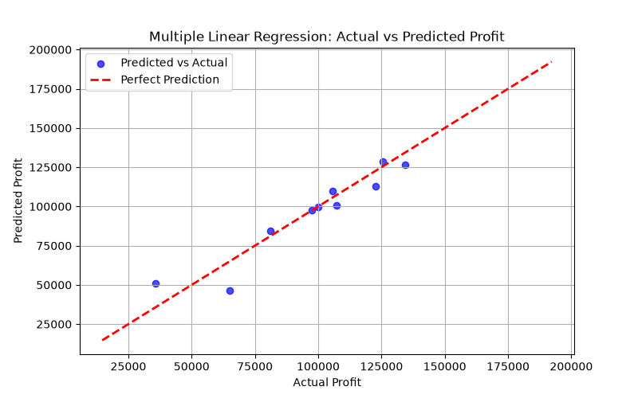

# Multiple Linear Regression: 50 Startups Profit Prediction

This project implements a **Multiple Linear Regression** model adhering strictly to the **CRISP-DM (Cross-Industry Standard Process for Data Mining)** methodology to predict the profit of startup companies based on their expenditures and location.

---

## 📋 Table of Contents
- [Overview & Objective](#overview--objective)
- [CRISP-DM Methodology](#crisp-dm-methodology)
  - [1. Business Understanding](#1-business-understanding)
  - [2. Data Understanding](#2-data-understanding)
  - [3. Data Preparation](#3-data-preparation)
  - [4. Modeling](#4-modeling)
  - [5. Evaluation](#5-evaluation)
  - [6. Deployment](#6-deployment)
- [Requirements & Installation](#requirements--installation)
- [Usage](#usage)
- [Results Summary](#results-summary)

---

## 🎯 Overview & Objective
Venture capitalists and investors need reliable tools to evaluate potential returns on investments. This project analyzes financial spending patterns (R&D, Administration, and Marketing) across different US states to predict overall startup profit.

---

## 🔄 CRISP-DM Methodology

### 1. Business Understanding
* **Goal**: Predict `Profit` (USD) for a startup based on operational expenditures and geographical state.
* **Business Impact**: Assists venture capitalists and founders in capital allocation, forecasting, and investment decision-making.

### 2. Data Understanding
* **Dataset**: `50_Startups.csv`
* **Size**: 50 records, 5 features.
* **Attributes**:
  * `R&D Spend`: Research & Development budget.
  * `Administration`: Administrative overhead expenses.
  * `Marketing Spend`: Advertising and marketing budget.
  * `State`: Geographical location (`New York`, `California`, `Florida`).
  * `Profit`: Net profit earned (Target variable $y$).
* **Data Quality**: 0 missing values across all features.

### 3. Data Preparation
* **Categorical Encoding**: One-Hot Encoding applied to `State` using `ColumnTransformer` with `drop='first'` to prevent the dummy variable trap (multicollinearity).
* **Train/Test Split**: 80% training set (40 startups) and 20% test set (10 startups) using `random_state=42`.

### 4. Modeling
* **Algorithm**: Ordinary Least Squares (OLS) Multiple Linear Regression.
* **Trained Equation**:
  $$\text{Profit} = w_0 + w_1 X_1 + w_2 X_2 + w_3 X_3 + w_4 X_4 + w_5 X_5$$
* **Fitted Intercept ($b$)**: `54,028.04`
* **Fitted Coefficients ($w$)**: `[9.3879e+02, 6.9900e+00, 0.81, -0.07, 0.03]`

### 5. Evaluation
Model performance on the unseen test set:

| Metric | Score | Description |
| :--- | :--- | :--- |
| **MAE** | `$6,961.48` | Mean Absolute Error |
| **RMSE** | `$9,055.96` | Root Mean Squared Error |
| **$R^2$ Score** | **`0.8987`** | ~89.9% of the variance in profit is explained by the features |

#### Visualization:
The actual vs. predicted profit plot is exported to `actual_vs_predicted.png`.



### 6. Deployment
Example prediction for an unseen startup:
* **State**: California
* **R&D Spend**: $150,000
* **Administration**: $100,000
* **Marketing Spend**: $300,000
* **Predicted Profit**: **`$176,950.39`**

---

## 💻 Requirements & Installation

1. Clone the repository:
   ```bash
   git clone https://github.com/naz0914/Multiple-Linear-Regression.git
   cd Multiple-Linear-Regression
   ```

2. Install dependencies:
   ```bash
   pip install -r requirements.txt
   ```

---

## 🚀 Usage

Execute the complete pipeline:
```bash
python multiple_linear_regression.py
```
